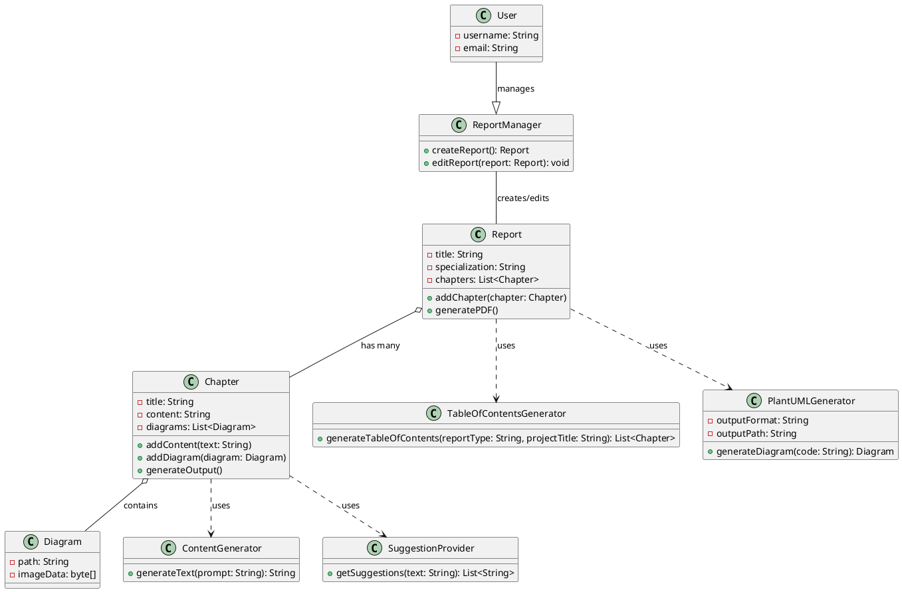

# Complex Markdown Example

## Table of Contents

1. [Introduction](#introduction)
2. [Code Blocks](#code-blocks)
3. [Lists](#lists)
4. [Tables](#tables)
5. [Footnotes](#footnotes)
6. [References](#references)

---

## Introduction

Welcome to this extensive Markdown example. Here you'll find various Markdown syntax elements used in practice.

**Bold text**, *italic text*, and `inline code` are all here.

**Diagrams**


> *Blockquotes* are used to indicate a quote or important note.

---

## Code Blocks

```python
# This is a Python code block
def hello_world():
    print("Hello, world!")
```


---

<!-- This is a Markdown code block -->
- **Bold List Item**
- *Italic List Item*
- `Code List Item`

---

## Lists

### Ordered List

1. First item
2. Second item
   1. Subitem 1
   2. Subitem 2
3. Third item

### Unordered List

- Item 1
  - Subitem 1
  - Subitem 2
- Item 2

### Mixed List

1. Ordered item
   - Unordered subitem
2. Ordered item

---

## Tables

| Header 1 | Header 2 | Header 3 |
|----------|----------|----------|
| Row 1    | Data 1   | Data 2   |
| Row 2    | Data 3   | Data 4   |

| Column 1 | Column 2 |
|----------|----------|
| **Bold** | *Italic* |
| `Code`   | ~~Strikethrough~~ |

---

## Footnotes

Here is a reference to a footnote[^1].

[^1]: This is the footnote.

---

## References

For more information, visit [Markdown Guide](https://www.markdownguide.org).

---

## Emojis

Here are some emojis: 🎉 🚀 😎

---

## Mathematical Expressions

Inline math: \(a^2 + b^2 = c^2\)

Block math:
\[ \int_{0}^{\infty} e^{-x} \, dx = 1 \]


## Custom Styles

---

<p class="highlight">This text is highlighted.</p>

<p>This is an HTML paragraph.</p>

<details>
<summary>Details</summary>
<p>This is additional content that is hidden until the details are expanded.</p>
</details>

<span style="color: blue;">This text is blue.</span>

<p class="highlight">This text is highlighted.</p>
